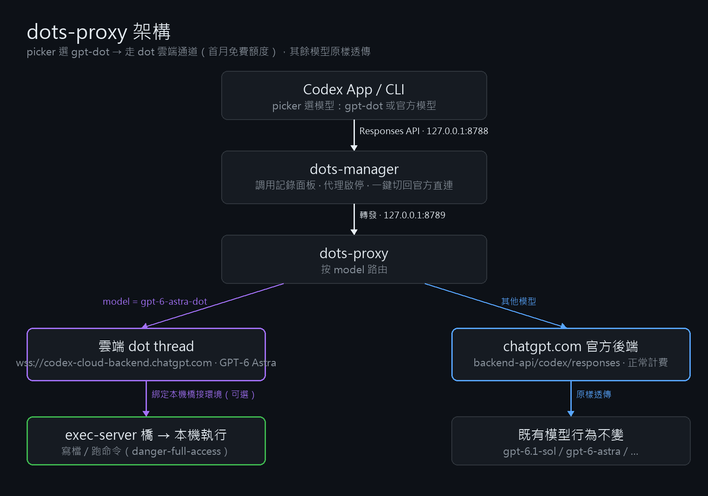

# dots-proxy



把 OpenAI 的 dot（雲端常駐代理）變成 Codex 裡的一個 picker 模型：選中 `gpt-dot` 後，請求走 dot 雲端通道執行，還能通過本機橋接環境直接操控你的電腦。其餘模型原樣透傳官方後端，互不影響。

> ⚠ 本項目使用 OpenAI 未公開的內部接口（逆向自官方桌面端），僅供個人學習研究，可能隨官方調整失效；請自行評估帳號風險。

## 組成

| 文件 | 作用 |
|---|---|
| `dots-manager.mjs` | 常駐管理器（`127.0.0.1:8788`）：調用記錄面板、代理啟停、一鍵切回官方直連 |
| `dots-proxy.mjs` | 代理子進程（`127.0.0.1:8789`）：Responses API → dot 雲端 thread；其他模型透傳 |
| `dots-model-catalog.json` | 模型目錄（picker 列表來源），含 `gpt-dot` 條目 |
| `dots-marketplace/` | Codex 插件（MCP 工具：`dot_ask` / `dot_message` / `dot_status`） |
| `ws-client.mjs` | 裸 TLS WebSocket JSON-RPC 客戶端（過 Cloudflare 的關鍵） |

## 原理

```
codex app/CLI ──Responses API──▶ 127.0.0.1:8788 (manager)
                                   └─▶ 127.0.0.1:8789 (proxy)
                                         ├─ model=gpt-6-astra-dot → wss://codex-cloud-backend.chatgpt.com 開雲端 thread
                                         │    （可綁定本機橋接環境 → 命令直接在本機執行）
                                         └─ 其他模型 → 透傳 chatgpt.com/backend-api/codex/responses
```

- dot 本體是 hosted 雲端 thread（`threadSource: "aeon"`），協議與本地 app-server 相同
- 過 Cloudflare 需要帶齊 `Authorization` / `chatgpt-account-id` / codex UA / `originator: codex_cli_rs` 四個頭,且用裸 TLS 握手(Node 內建 WebSocket 會被擋)
- 認證複用 `~/.codex/auth.json`，過期自動用 refresh_token 續期

## 安裝

前置：已登錄的 codex CLI（`~/.codex/auth.json` 存在）、Node ≥ 22。

```bash
# 1. 啟動管理器（會自動拉起代理）
node dots-manager.mjs

# 2. config.toml 加入（或直接在面板點「恢復 dots 代理」）
model_provider = "dots"
model_catalog_json = "<本目錄絕對路徑>/dots-model-catalog.json"

[model_providers.dots]
name = "dots"
base_url = "http://127.0.0.1:8788/v1"
wire_api = "responses"
requires_openai_auth = true
```

重啟 codex / 桌面 app，picker 裡選 `gpt-dot`。

### 本機操控（可選）

默認 dot 在雲端跑、碰不到本機。要讓它直接操作你的電腦：

1. 確認桌面 app 正在運行（它會啟動 exec-server 橋接進程）
2. 找到橋接環境 ID：進程列表裡 `codex.exe exec-server --environment-id <id>` 的值
3. 設置環境變量 `DOTS_ENV_ID=<id>` 後啟動代理

⚠ 此模式以 `danger-full-access` + 免審批運行，dot 可在你本機執行任何命令。

## 面板

`http://127.0.0.1:8788/` — 調用記錄（模型/effort/耗時/狀態）、服務啟停、一鍵切回官方直連（自動備份並恢復 config）。

## 安全說明

- 所有數據只在本機；調用記錄存於 `dots-proxy-calls.jsonl`（已被 gitignore）
- token 不離開本機，僅用於官方後端認證
- 回滾：面板點「切回官方直連」，或用 `~/.codex/config.toml.bak-*` 備份覆蓋
